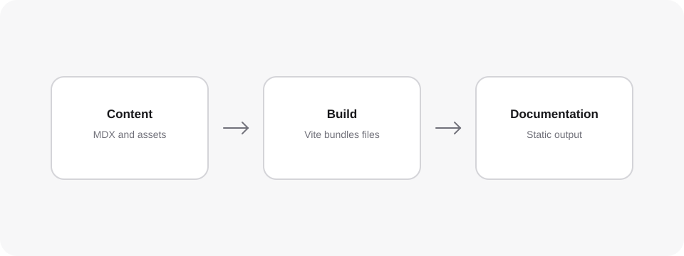

<CodeSnippet
  code={`<Image
  src="../assets/local-architecture.svg"
  alt="Three layers: content, build, documentation"
  caption="A local SVG stored with the documentation content."
/>`}
>
  <Image
    src="../assets/local-architecture.svg"
    alt="Three layers: content, build, documentation"
    caption="A local SVG stored with the documentation content."
  />
</CodeSnippet>

`Image` gives local and remote images a responsive documentation treatment.
Use it when a diagram, screenshot, or product image carries information that
would be difficult to explain with prose alone. Standard Markdown images work
too; choose `Image` when you need a caption or native image attributes.

## Keep local assets next to the content they explain

Use a relative `src` for an image stored in the project. Heyo Docs copies local
assets into the production build and rewrites the URL, so the same path works in
development and after deployment. A path is resolved from the current MDX file,
which makes a page and its supporting assets easy to move together.

```md


<Image
  src="../assets/local-architecture.svg"
  alt="Three layers: content, build, documentation"
  caption="The local content pipeline."
/>
```

This is a good fit for architecture diagrams, flow charts, and screenshots
owned by the documentation repository. Prefer SVG for diagrams and icons that
need to remain sharp at every size.

## Write alt text for the information in the image

Alt text should communicate the image's purpose, not merely its file format or
colour. Describe the relationship or result a reader would otherwise miss. If
the image is purely decorative, use an empty `alt` value so assistive technology
can skip it.

<CodeSnippet
  code={`<Image
  src="https://images.unsplash.com/photo-1451187580459-43490279c0fa?auto=format&fit=crop&w=1600&q=80"
  alt="Earth viewed from space with city lights visible at night"
  caption="Use a caption when readers need context beyond the image itself."
  loading="lazy"
/>`}
>
  <Image
    src="https://images.unsplash.com/photo-1451187580459-43490279c0fa?auto=format&fit=crop&w=1600&q=80"
    alt="Earth viewed from space with city lights visible at night"
    caption="Use a caption when readers need context beyond the image itself."
    loading="lazy"
  />
</CodeSnippet>

Use a caption to name a figure, explain when a screenshot was taken, or call
out the detail a reader should inspect. Do not repeat the alt text verbatim: alt
text makes the image accessible, while a caption provides surrounding context
for every reader.

## Choose the right source

Local files are best for diagrams and screenshots that must change with the
documentation. A stable HTTPS URL can work for a public image maintained
elsewhere, but it introduces an external dependency and may be slower or change
without notice. For product documentation, a checked-in local asset is usually
the safer default.

## Use a different image in light and dark mode

For screenshots whose interface changes with the documentation color mode, use
`lightSrc` and `darkSrc`. When either themed source is supplied, `Image` does
not render `src`; it renders only the mode-specific images. Provide both themed
sources so every visitor sees the matching screenshot.

```md
<Image
  lightSrc="../assets/checkout-light.png"
  darkSrc="../assets/checkout-dark.png"
  alt="Checkout settings in the Heyo dashboard"
  caption="The same checkout screen in the documentation's light and dark modes."
/>
```

The image for the active mode is visible, while its counterpart remains hidden.
`lightSrc` and `darkSrc` accept the same local relative paths and remote HTTPS
URLs as `src`, and local files are bundled automatically. Do not add a fallback
`src` to this pattern: it is ignored whenever a themed source is present.

## Properties

<Properties>
  <Property name="src" type="string">
    The local relative path or remote HTTPS URL of the image. Relative local
    assets are bundled with the documentation build. Omit it when using
    <code>lightSrc</code> and <code>darkSrc</code>.
  </Property>
  <Property name="lightSrc / darkSrc" type="string">
    Sources for the light and dark documentation modes. When either is set,
    Image renders the themed sources instead of <code>src</code>. Use both
    values together for a screenshot in each mode.
  </Property>
  <Property name="alt" type="string" required>
    A concise text alternative that explains the information carried by the
    image. Use an empty string only for a decorative image.
  </Property>
  <Property name="caption" type="ReactNode">
    Optional text displayed below the framed image. Use it for figure context, a
    source note, or a detail that readers should inspect.
  </Property>
  <Property name="loading" type='"lazy" | "eager"'>
    Native image loading behaviour. It defaults to <code>lazy</code>; use
    <code>eager</code> only for an image needed immediately near the top of a
    page.
  </Property>
  <Property name="width / height" type="number | string">
    Native image dimensions. Provide them when known to reserve layout space and
    reduce visual movement while the image loads.
  </Property>
  <Property name="className" type="string">
    Extra classes for a custom presentation. Without it, Image provides the
    responsive framed treatment used throughout the documentation.
  </Property>
</Properties>
